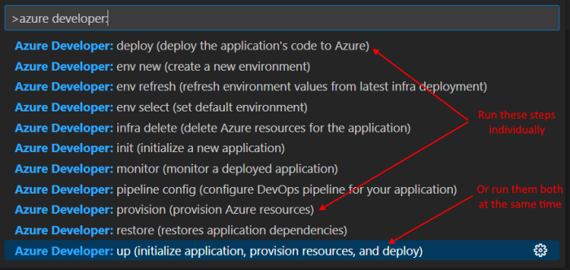
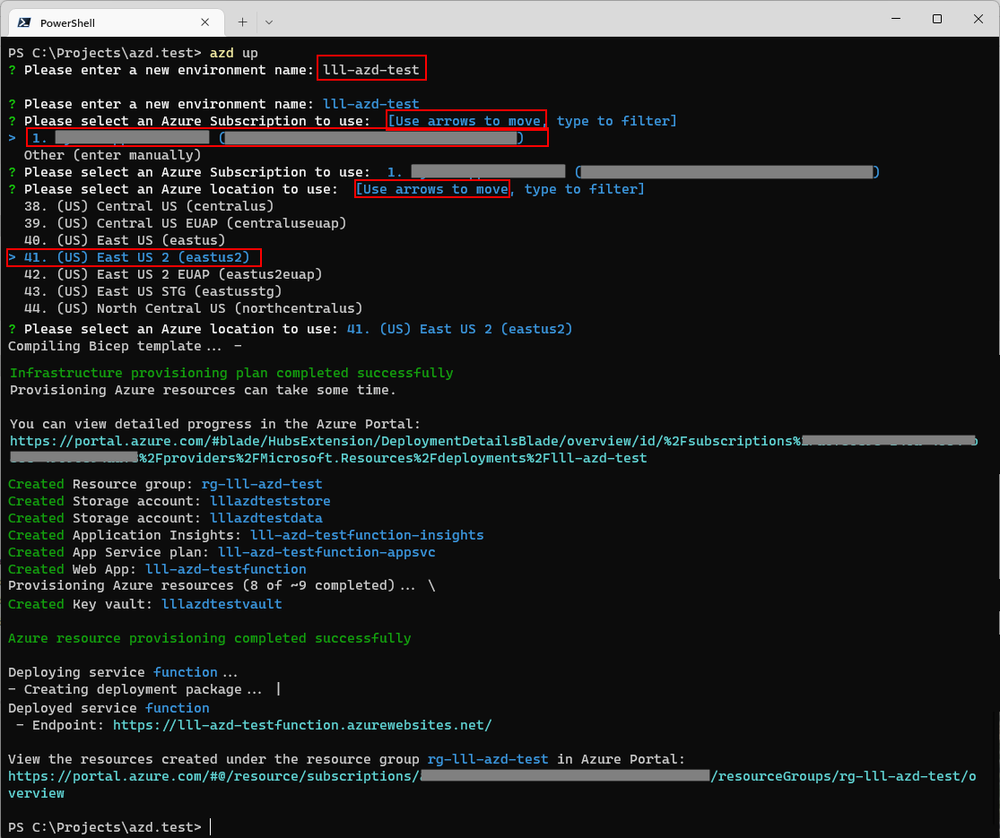
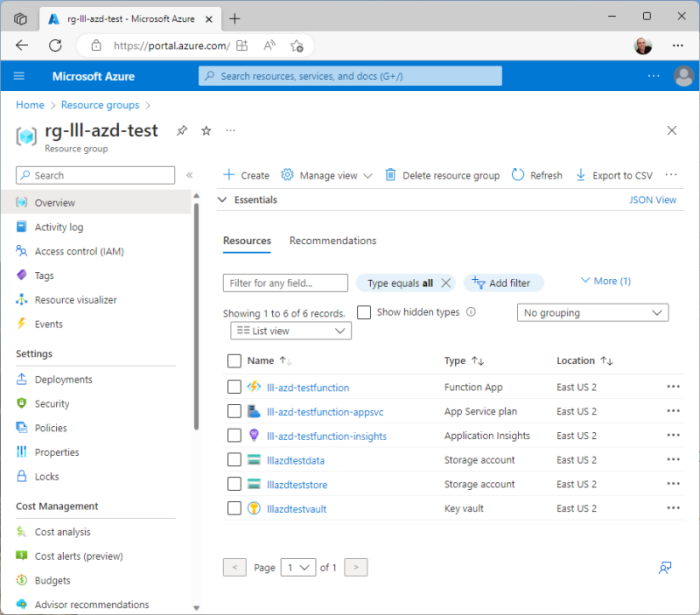

# AZD Command Line Deploy

The Azure Developer CLI (azd) is an open-source tool that accelerates the time it takes to get started on Azure. azd provides a set of developer-friendly commands that map to key stages in a workflow (code, build, deploy, monitor).

This project has been configured to work with AZD commands to make it fast and easy to deploy a demo.

---

## Configuration Secrets

This application requires a few secrets to be configured in the application before being deployed.

> *`Note 1: these settings are stored in clear text in the .env file in the .azure/<yourEnvironment> directory. Be sure to edit the .azure/.gitignore file to exclude the <yourEnvironment> directory from being checked into source control!`*

> *Note 2: the first time you run the azd command, you will be prompted for the Environment Name, Azure Subscription and Azure Region to use -- see section below for information on choosing a good Environment Name.*

## Current AZD Behavior

The AZD project config is in [azure.yaml](../azure.yaml) and currently points to:

- Infra template: `infra/Bicep/main.bicep`
- AZD parameter file: `infra/Bicep/main.parameters.json`
- Service project: `src/web/Website`
- Service host: App Service

By default, AZD deploys website-focused infrastructure and deploys the web app.

## Default Infrastructure Mode

`infra/Bicep/main.parameters.json` currently sets:

- `deploymentType = appservice`
- `websiteOnly = true`
- `appDataSource = JSON`

That means AZD runs in website-only mode and does not provision SQL/Function resources for this path.

---

## Environment Names

When an AZD command is run for the first time, a prompt will ask for the "Environment Name", the Azure Subscription to use and the Azure Region to deploy to.

> *`NOTE: This "Environment Name" is NOT an environment code like [dev/qa/prod]!`*

Choose the "Environment Name" carefully, as it will be used as the basis to name all of the resources, so it must be unique. Use a naming convention like *[yourInitials]-[appName]* or *[yourOrganization]-[appName]* as the format for Environment Name. The resulting web application name `MUST` be globally unique.

For example, if Environment Name is equal to: 'xxx-chatgpt', AZD will create a Azure resources with these names:

| Azure Resource | Name              | Uniqueness        |
| -------------- | ----------------- | ----------------- |
| Resource Group |  rg-xxx           | in a subscription |
| Azure Website  |  xxx-azd          | global            |

Storage accounts and other resources will be named in a similarly fashion.

## Useful Commands

- Provision infra only: `azd provision --no-prompt`
- Deploy app only: `azd deploy --no-prompt`
- Full run: `azd up --no-prompt`
- Destroy env resources: `azd down --no-prompt`

---

## Visual Studio Code

There is a Azure Developer CLI [extension](https://marketplace.visualstudio.com/items?itemName=ms-azuretools.azure-dev) available in Visual Studio Code. If that is installed, it is easy to pop up the command window like this:




---

## Command Line

These commands can also be run on the command line, like this:

```bash
> azd up
```

## Example Command Execution



### Resources Created



---

## References

- [Azure Developer CLI docs](https://learn.microsoft.com/en-us/azure/developer/azure-developer-cli/)
- [Make a project AZD-compatible](https://learn.microsoft.com/en-us/azure/developer/azure-developer-cli/make-azd-compatible?pivots=azd-create)
